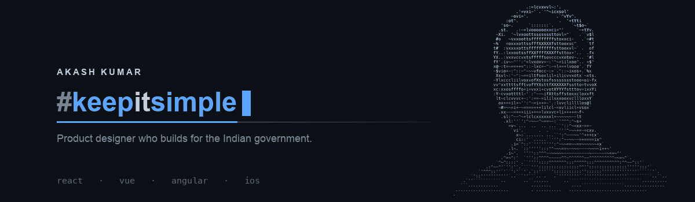

  

# Akash Kumar

**Product designer who builds.** I design national-scale digital products for the Indian government, then implement them in code.

I work where design rigour meets frontend. I define how an interface should behave and build it in React, Vue, or Angular. What I care about most is the part most people skip: what the screen says when something breaks on a slow connection. On public products used across India, that moment decides whether someone reaches a service or gives up.

Before this, I worked across Tata Neu, one of India's largest super apps. Consumer scale taught me momentum; public-sector scale taught me inclusion. Not many designers get to learn both.

---

## What I do

- **UX for complex systems.** Government portals and citizen-facing flows, designed accessibility-first for people on old phones, slow networks, and second languages.
- **Design systems.** Tokens, components, and documentation that bridge Figma and code, so a product speaks one language everywhere.
- **Frontend.** React, Vue, and Angular, built with an eye on visual precision and interaction quality. I define the experience, then ship it in code.
- **Mobile.** iOS and Android, with a focus on native feel.

---

## Currently

Unifying sprawling public-sector platforms into single, coherent systems for the Indian government. The constraint here isn't creativity, it's clarity at scale.

---

## Find my work

---

## Tools

**Design**

**Motion**

**Frontend**

**Mobile & Backend**

---

If you're working on a hard interface problem, or you just want to argue about why design matters, I'm around. Find me on [LinkedIn](https://linkedin.com/in/akashshivanand).

*Keep it simple. I simplify complex systems for a living, and overthink outfit combinations for fun.*
